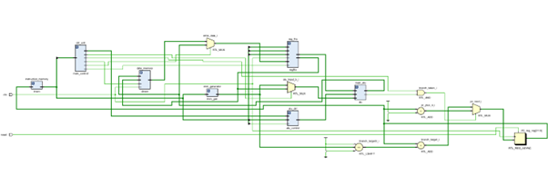

# RISC-V Single-Cycle Processor Implementation

## Project Overview
This repository contains a Verilog implementation of a 32-bit single-cycle RISC-V CPU core. The design follows the **RV32I ISA** subset, focusing on the core execution stages: Fetch, Decode, Execute, Memory, and Write-back.

The processor is designed for modularity, featuring separate units for `ALU control`, `immediate generation`, and `register management`.

### Successfully Implemented Instructions:
* **R-type:** `ADD`
* **I-type:** `ADDI`, `LW`
* **S-type:** `SW`
* **B-type:** `BEQ`

---

## Architecture and Design
* **Control Unit:** Decodes the 7-bit opcode to manage control signals for the ALU, Register File, and Data Memory.
* **ALU:** 32-bit arithmetic logic unit providing results and a zero flag used for conditional branches.
* **Branching Mechanism:** Target addresses are calculated using a 1-bit left shift on the immediate value to ensure proper half-word alignment, as per RISC-V specifications.
* **Memory Architecture:** Implements a Harvard-style architecture with separate instruction and data memory modules.

## System Architecture

To provide a clear understanding of the processor's internal structure and logic flow, two types of diagrams are provided:

### 1. Logical Datapath (Academic View)
This schematic is based on the **RISC-V Edition of "Computer Organization and Design" (Patterson & Hennessy)**. It provides a conceptual view of the instruction flow and control signals.


---

### 2. RTL Schematic (Hardware View)
This is the actual **Vivado RTL Analysis Schematic** generated from the Verilog source code, showing how the modules are synthesized into hardware logic.


---

## Simulation and Verification
Verification was performed using the **Vivado Simulator** environment.

### Test Program Example
The following sequence was used to verify data flow and branching:
```assembly
addi x1, x0, 5      # Initialize x1
addi x2, x0, 5      # Initialize x2
beq x1, x2, 8       # Jump if equal (skips next instruction)
addi x3, x0, 9      # Should be skipped
sw x1, 0(x0)        # Store value to memory
lw x5, 0(x0)        # Load value back to register x5


