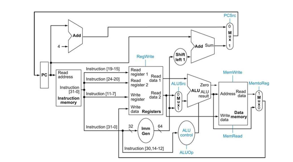

# RISC-V 5-Stage Pipelined Processor Implementation

### Project Overview

This repository contains a Verilog implementation of a **32-bit 5-stage pipelined** RISC-V CPU core. The design follows the **RV32I ISA** subset and handles instruction execution through a classic pipeline: Fetch (IF), Decode (ID), Execute (EX), Memory (MEM), and Write-back (WB).
The processor is optimized for performance and reliability, featuring dedicated units for **Forwarding** and **Hazard Detection** to ensure data integrity across the pipeline stages.

**Successfully Implemented Instructions:**
* **R-type:** ADD
* **I-type:** ADDI, LW
* **S-type:** SW
* **B-type:** BEQ

### Architecture and Design

* **Pipelined Control Unit:** Decodes instructions in the ID stage and propagates control signals through pipeline registers to manage EX, MEM, and WB stages.
* **Forwarding Unit:** Resolves RAW (Read-After-Write) hazards by directing data from EX/MEM and MEM/WB registers back to the ALU inputs, minimizing pipeline stalls.
* **Hazard Detection & Stalling:** Automatically detects Load-Use hazards and stalls the pipeline for one cycle. It also manages pipeline flushes during taken branches to prevent incorrect instruction execution.
* **Memory Architecture:** Implements a Harvard-style architecture with separate instruction and data memory, integrated with pipeline registers for synchronized access.

### System Architecture

To provide a clear understanding of the processor's internal structure and logic flow, two types of diagrams are provided:

**1. Logical Datapath (Academic View)**
This schematic reflects the 5-stage pipeline architecture with forwarding paths and hazard units, based on the RISC-V Edition of "Computer Organization and Design" (Patterson & Hennessy).



---

**2. RTL Schematic (Hardware View)**
The actual Vivado RTL Analysis Schematic generated from the synthesized Verilog code, showing the implementation of pipeline registers (IF/ID, ID/EX, EX/MEM, MEM/WB) and control logic.


---

### Simulation and Verification

Verification was performed using the **Vivado Simulator** environment, confirming the correct handling of data forwarding and branch flushes.

**Test Program Example**
The following sequence was used to verify the pipeline's ability to handle data flow, control hazards, and memory operations:
```assembly
#Forwarding (ALU to ALU)
addi x1, x0, 10     
addi x2, x1, 5      
add  x3, x2, x1      

#Load-Use Hazard (Stall)
sw   x3, 0(x0)      
lw   x4, 0(x0)      
addi x5, x4, 1       

#Branch ו-Flush
beq  x1, x1, 8      
addi x6, x0, 99      
addi x7, x0, 1      


